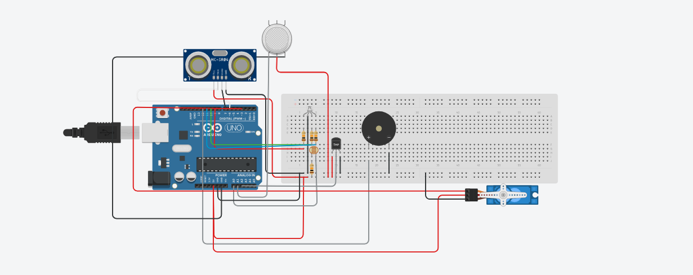

# 🤖 SmartDesk 2050 — Estação Inteligente de Trabalho

## 👥 Integrantes
- Murilo Jeronimo Ferreira Nunes — RM560641  
- Bruno Santos Castilho — RM5667994  

## 🌍 Visão Geral
O **SmartDesk 2050** é uma estação de trabalho inteligente que promove **bem-estar, produtividade e sustentabilidade** por meio de **automação e sensores IoT**.  
Utilizando um **Arduino Uno**, o sistema monitora **temperatura, umidade, luminosidade, qualidade do ar e presença humana**, ajustando automaticamente o ambiente para oferecer as melhores condições de trabalho.

---

## ⚙️ Tecnologias Utilizadas
- **Arduino UNO**
- **Sensor DHT11** — temperatura e umidade  
- **Sensor LDR** — luminosidade ambiente  
- **Sensor MQ-135** — qualidade do ar  
- **Sensor Ultrassônico HC-SR04** — detecção de presença  
- **Servo Motor** — controle de persiana/luz  
- **LED RGB** — indicador visual de status ambiental  
- **Buzzer** — alertas sonoros  
- **Protoboard e jumpers**

---

## 💡 Funcionalidades
✅ Monitora **temperatura**, **umidade**, **luminosidade** e **qualidade do ar** em tempo real  
✅ Detecta **presença humana** com sensor ultrassônico  
✅ Ajusta **persianas/luzes automaticamente** via servo motor  
✅ Exibe status ambiental com **LED RGB**:
- 🟢 **Verde:** ambiente ideal  
- 🟡 **Amarelo:** pouca luz  
- 🔴 **Vermelho:** ambiente ruim (calor, baixa umidade ou ar poluído)  
✅ Emite **alertas sonoros** com o buzzer em caso de ambiente inadequado ou pausa prolongada

---

## 🧩 Esquema de Montagem

Abaixo, o circuito completo montado no Tinkercad, com todos os sensores e atuadores conectados ao Arduino Uno:

- 🔌 Conexões Principais
- Componente	Pinos	Descrição
- DHT11	VCC → 5V / GND → GND / S → 2	Sensor de temperatura e umidade
- LDR	Um terminal → 5V / outro → A0 + resistor 10kΩ → GND	Sensor de luminosidade
- MQ135	VCC → 5V / GND → GND / AOUT → A1	Sensor de qualidade do ar
- HC-SR04	VCC → 5V / GND → GND / TRIG → 6 / ECHO → 7	Sensor de presença
- Servo	Sinal → 3 / VCC → 5V / GND → GND	Movimento automático
- Buzzer	+ → 12 / - → GND	Alerta sonoro
- LED RGB (cátodo comum)	R → 9 / G → 10 / B → 11 / comum → GND (via resistores 220Ω)

---

## 🎯 Impacto e Futuro

O projeto SmartDesk 2050 propõe uma abordagem sustentável e inteligente para o ambiente de trabalho do futuro, utilizando tecnologia acessível para promover:

- Saúde e bem-estar no ambiente laboral

- Eficiência energética com automação ambiental

- Inclusão e adaptação ao futuro do trabalho

